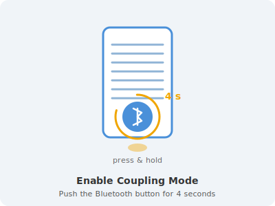

# hacs-gira-system-3000
HACS Integration for Gira System 3000 bluetooth cover for Home Assistant

## Installation

### Via HACS (recommended)

1. Open HACS in your Home Assistant instance.
2. Go to **Integrations** → **⋮** → **Custom repositories**.
3. Add `https://github.com/Kailijan/hacs-gira-system-3000` as an **Integration**.
4. Search for **Gira System 3000** and install it.
5. Restart Home Assistant.
6. Go to **Settings** → **Devices & Services** → **Add Integration** and search for **Gira System 3000**.

### Manual installation

1. Copy the `custom_components/gira_system_3000` folder to your Home Assistant `config/custom_components/` directory.
2. Restart Home Assistant.
3. Add the integration via **Settings** → **Devices & Services**.

## Setup & Coupling

Before the Gira Cover Switch can communicate with Home Assistant, it must be **coupled** once.
This coupling step is part of the integration setup wizard.

### How to enable coupling mode

Press and hold the **Bluetooth button** on the Gira Cover Switch for **4 seconds** until the LED flashes.
The device is now in coupling mode and will accept a new connection from Home Assistant.

Once the device shows the coupling LED signal, click **Submit** in the Home Assistant setup dialog to complete the pairing.

## Supported devices

- Gira System 3000 blind/cover actuator (BLE)

## Testing and development

### Recommended: Raspberry Pi with Home Assistant OS

For reliable BLE device communication, test on a **Raspberry Pi running Home Assistant OS** or Home Assistant Supervised. The native Bluetooth adapter connects to the Gira device without additional indirection and works out of the box.

Deployment steps:
1. Install Home Assistant OS on your Raspberry Pi ([official guide](https://www.home-assistant.io/installation/)).
2. Copy `custom_components/gira_system_3000` to the HA config directory (e.g. via the Samba or SSH add-on).
3. Restart Home Assistant and add the integration.

### Devcontainer (code editing only)

A devcontainer is provided for local development. It lets you edit the code, run linters, and test the config flow UI.

> **⚠️ BLE device control does not work reliably in the devcontainer on Windows/WSL2.**
> USB-IP Bluetooth passthrough introduces latency that causes BLE connection timeouts when
> connecting to the physical Gira Switch. Code editing, linting, and config flow testing are unaffected.
> See [.devcontainer/README.md](.devcontainer/README.md) for details and a full setup guide.

